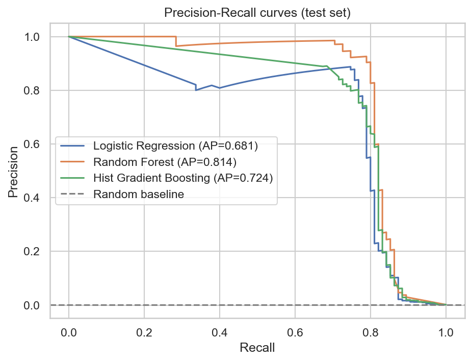
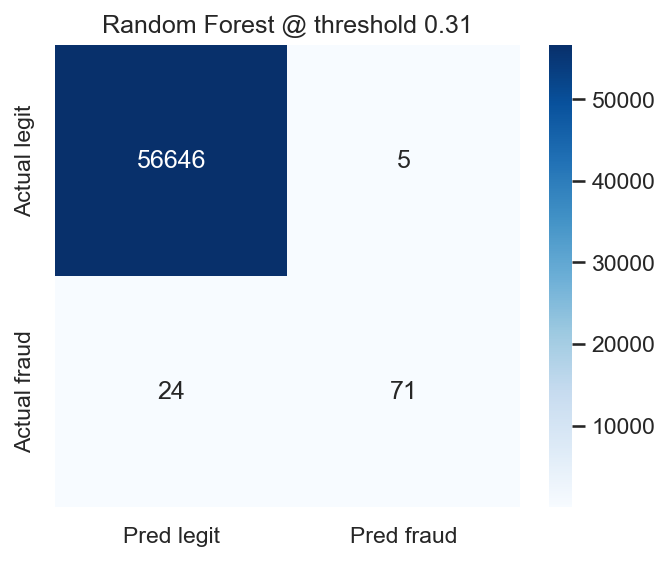
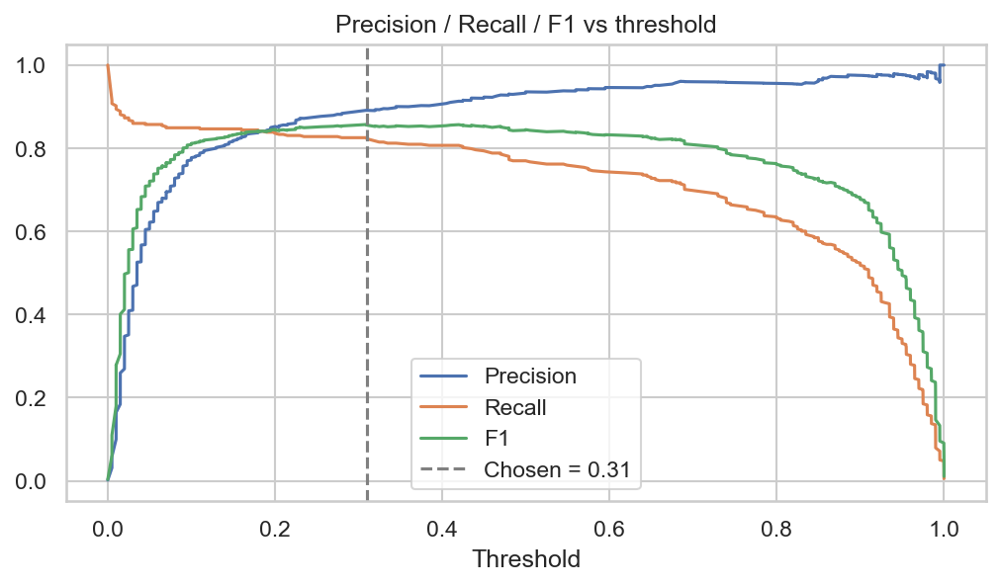
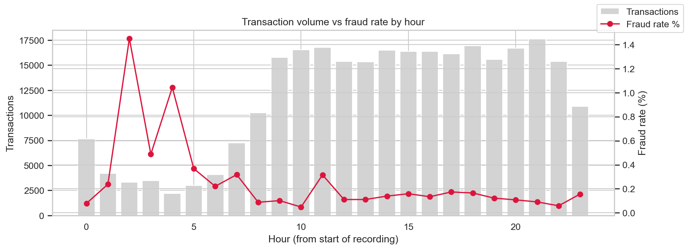
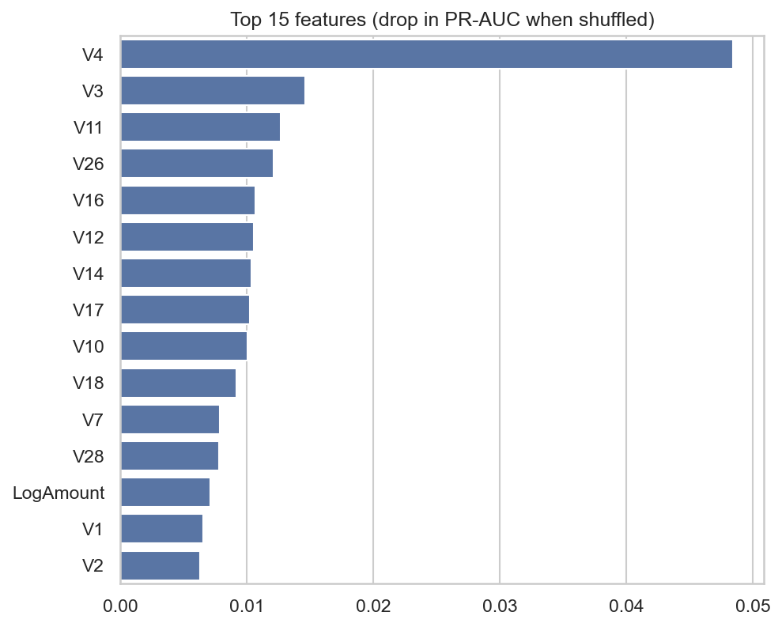
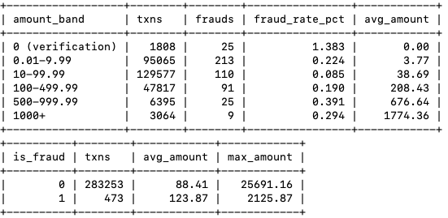
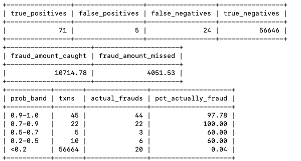

# Credit Card Fraud Detection & Transaction Analytics

Machine-learning fraud detection on 284K credit card transactions (0.17% fraud), with SQL-based transaction analytics in MySQL.

**Tech:** Python · Pandas · NumPy · Scikit-learn · Matplotlib · Seaborn · MySQL

## Problem
Fraud is rare (about 1 in 580 transactions), so accuracy is meaningless: a model that predicts "legit" for everything scores 99.8%. The goal is to catch as much fraud as possible without flooding analysts with false alerts.

## Dataset
[Kaggle – Credit Card Fraud Detection (ULB)](https://www.kaggle.com/datasets/mlg-ulb/creditcardfraud): 284,807 European card transactions over 2 days. `V1`–`V28` are anonymised PCA features, `Time` is seconds since the first transaction, `Amount` is the transaction value and `Class` is 1 for fraud.

## Approach
1. **Cleaning:** removed 1,081 duplicate rows; no missing values
2. **Feature engineering:** hour and day from `Time`, log-transformed `Amount`
3. **EDA:** fraud rate by hour, amount distributions, feature correlations
4. **Modelling:** Logistic Regression (scaled), Random Forest, Histogram Gradient Boosting, all class-weighted, with a stratified 80/20 split
5. **Evaluation:** PR-AUC as the main metric, plus 5-fold stratified cross-validation
6. **Threshold tuning:** decision threshold chosen from out-of-fold training predictions, not the test set
7. **Business impact:** fraud value caught vs missed, and false-alert volume
8. **SQL analytics:** MySQL schema plus 11 queries (aggregations, CASE bands, window functions, joins with model predictions)

## Results

**Model comparison** (test set, default 0.5 threshold, 95 frauds in 56,746 transactions)

| Model | CV PR-AUC | Test PR-AUC | ROC-AUC | Precision | Recall | F1 | False alarms |
|---|---|---|---|---|---|---|---|
| Logistic Regression | 0.756 ± 0.027 | 0.681 | 0.962 | 0.055 | 0.874 | 0.103 | 1,434 |
| **Random Forest** | **0.840 ± 0.034** | **0.814** | 0.944 | **0.958** | 0.726 | **0.826** | **3** |
| Hist Gradient Boosting | 0.748 ± 0.022 | 0.724 | 0.966 | 0.339 | 0.821 | 0.480 | 152 |

**Final model: Random Forest at tuned threshold 0.31**
- Precision **93.4%**, recall **74.7%**, F1 **0.83**
- **71 of 95 frauds caught**, with only **5 false alerts** among 56,651 legitimate transactions
- **72.6% of fraudulent transaction value caught**





## Key insights
- **ROC-AUC hides real differences on imbalanced data.** All three models scored 0.94–0.97 on ROC-AUC, yet Logistic Regression produced about 480× more false alarms than Random Forest. PR-AUC exposed this.
- **Model choice mattered more than threshold tuning.** Moving the threshold from 0.5 to 0.31 caught 2 more frauds for 2 extra false alerts; switching to Random Forest made the big difference.
- **Fraud concentrates in low-volume hours.** Hour 2 of the recording window has a 1.45% fraud rate, about 9× the 0.17% average.
- **Most predictive features:** V4, V3, V11, V26 and V16. V4 dominates: shuffling it drops PR-AUC by about 0.05, over 3× any other feature.




## SQL analytics
The cleaned transactions and the model's test predictions are loaded into MySQL. `sql/analysis_queries.sql` covers:
- fraud rate by hour, by amount band and by day
- ranking hours by risk, and rolling 3-hour fraud counts (window functions)
- the model's confusion matrix and the fraud value caught vs missed, computed in SQL by joining predictions with transactions
- alert precision by probability band, and a review queue of the highest-risk flagged transactions
- 


## Project structure
```
├── fraud_detection.ipynb     # full analysis and modelling
├── sql/
│   ├── schema.sql            # MySQL tables
│   └── analysis_queries.sql  # transaction analytics queries
├── images/                   # charts used in this README
├── requirements.txt
└── README.md
```

## How to run
1. Download `creditcard.csv` from the Kaggle link above into the project folder (it's too large for GitHub, so it isn't included).
2. Install the packages: `pip install -r requirements.txt`
3. Create the database: `mysql -u root -p < sql/schema.sql`
4. Set your MySQL password as an environment variable: `export MYSQL_PASSWORD=yourpassword`
5. Start Jupyter (`jupyter notebook`) and run the notebook top to bottom.

## Limitations and next steps
- V1–V28 are anonymised PCA components, so they can't be explained in business terms.
- The data covers only 2 days, and `Time` is relative, not real clock time.
- With only 95 frauds in the test set, each fraud shifts recall by about 1%, so the metrics are noisy.
- 24 frauds (27% of fraud value) were still missed. Next steps would be richer features (customer history, merchant data) and cost-sensitive thresholds.
